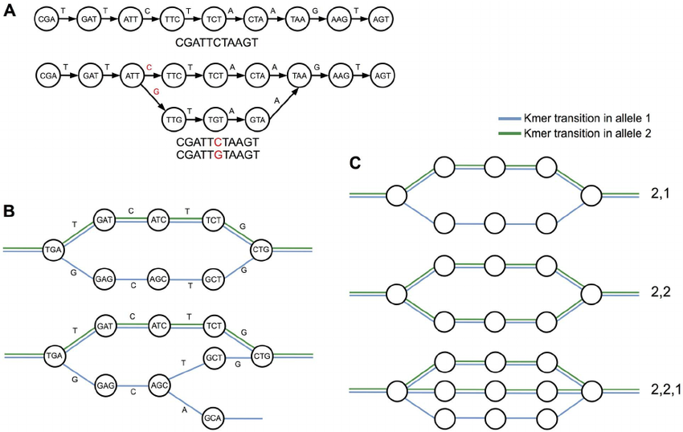
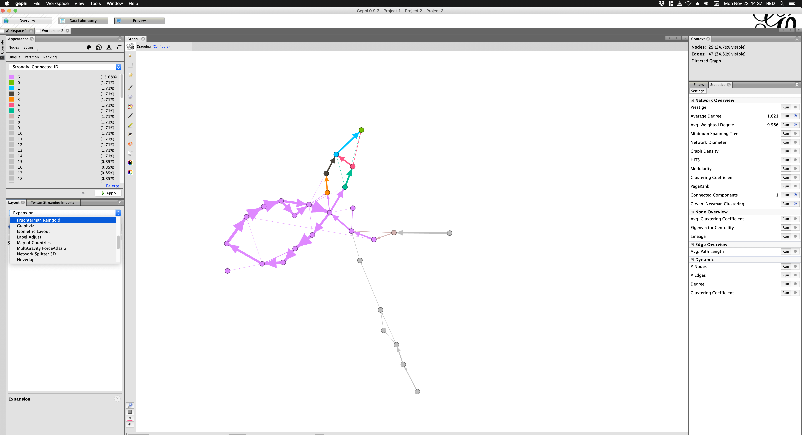
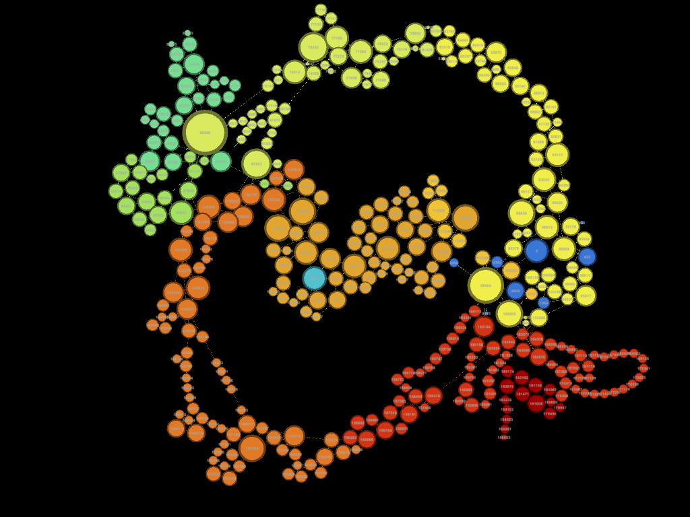
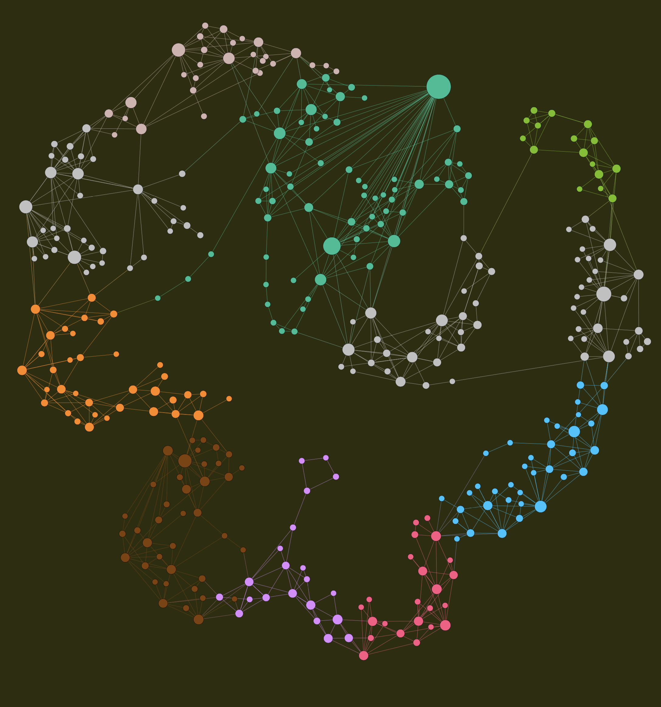
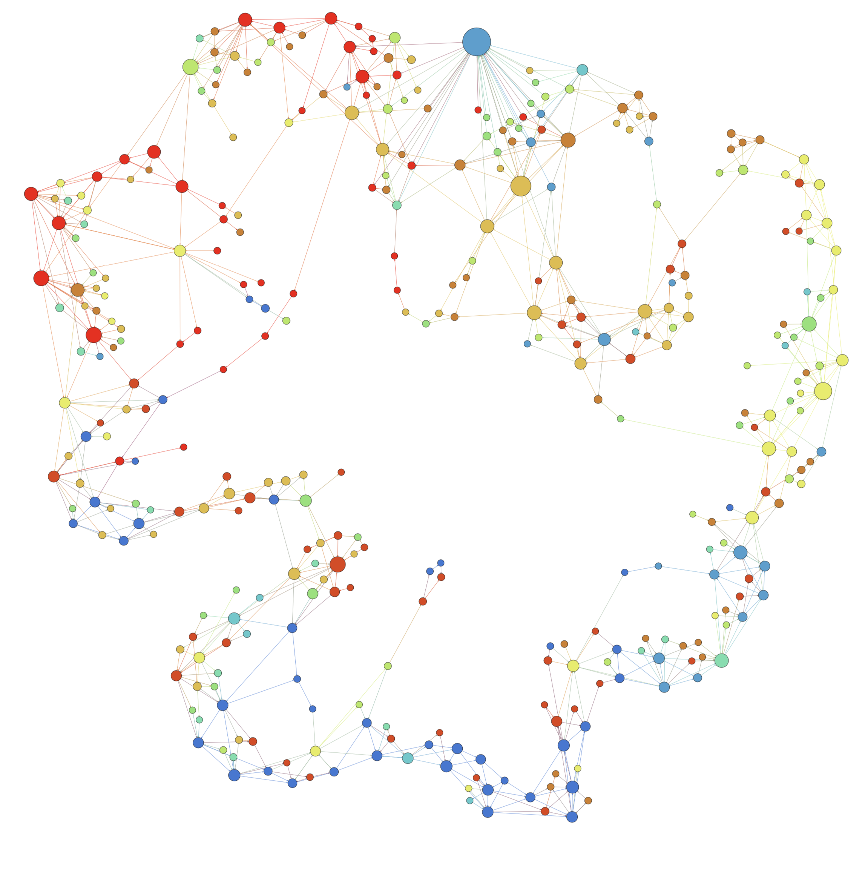
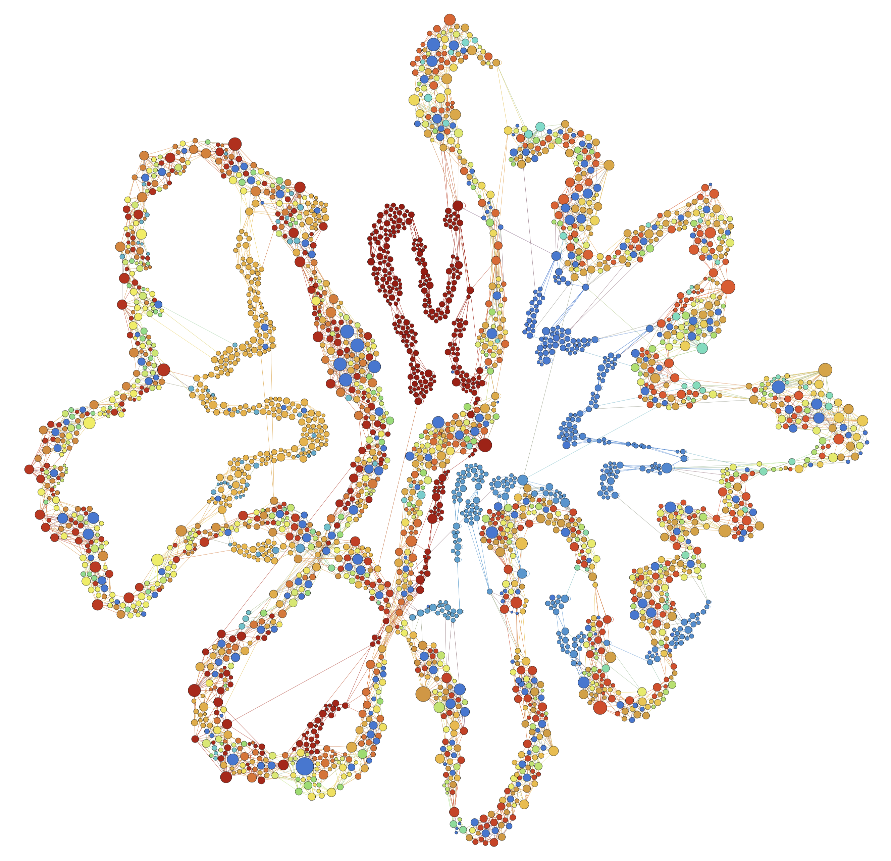

# CSCI_596
## Variant Graph Visualization

I want to build a program for visualization of dense network graphs. The graphs I am interested in are variant or repeat graphs that aid in assembly of polymorphic regions of a human genome.

---

Here is an example of a variant graph called de-brujin graph(directed).

**G=(V,E)**

V : k-mer representaion of variant in genome

E : overlap between two k-mers, Sequencing Reads

*Identifying and Classifying Trait Linked Polymorphisms in Non-Reference Species by Walking Coloured de Bruijn Graphs.PLoS ONE*

## Current Setup 
1. Build graph by streaming reads across variants
2. Load onto gephi 

3. Play around with:
- Layout Algorithm
- Color Pallete
- Filter nodes based on degree, edge attributes

4. Hope it looks informative / pretty

## Desired Features

1. High-throughput generation of images
- Consistent color palette

- Custom Force Algorithm to visualize relevant features. (n-body problem)
2. Perform graph analysis
 - connected component analysis 
 - network density 
 - distribution of degrees, edge weights
 
 
